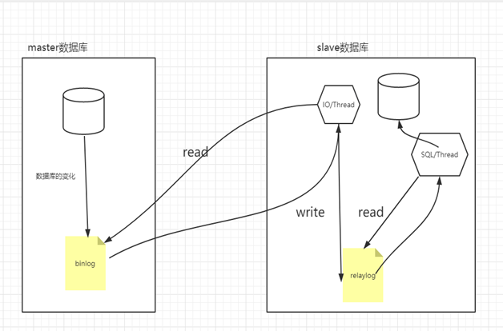

MySQL 支持配置 master-slave 模式，slave 从 master 定期同步数据，但不支持自动选举。常见的架构方式有：一主一从、一主多从(提升读性能)、多主一从(收集数据统计)等。

> 环境准备: 安装两台 MySQL-5.7 服务.

### 1. Master 节点配置
1. 创建用于数据同步的 mysql 用户  
`create user repl identified by 'repl';`
2. 为创建的用户授予同步权限  
`grant replication slave on *.* to 'repl'@'%' identified by 'repl';`
3. 修改配置文件 `/etc/my.cnf`, 开启binlog日志文件同步
```
[mysqld]
# 表示服务为一ID
server-id=104

# 开启日志同步, 设置日志文件名称
log_bin=mysql-bin

# 日志文件记录方式, 默认是 ROW 记录变更内容, STATEMENT 记录语句, MIXED 为二者混合方式
binlog_format=MIXED

# 日志文件同步周期, 0表示交给内核处理同步, N表示事务数
sync_binlog=1

# 日志文件自动删除天数, 默认为0表示不自动删除
expire_logs_days=7

# 不进行同步的数据库
binlog_ignore_db=mysql
binlog_ignore_db=information_schema
binlog_ignore_db=performation_schema
binlog_ignore_db=sys

```
4. 重启数据库, 查询 master 信息
```shell
mysql> show master status;
+------------------+----------+--------------+--------------------------------------------------+-------------------+
| File             | Position | Binlog_Do_DB | Binlog_Ignore_DB                                 | Executed_Gtid_Set |
+------------------+----------+--------------+--------------------------------------------------+-------------------+
| mysql-bin.000001 |      154 |              | mysql,information_schema,performation_schema,sys |                   |
+------------------+----------+--------------+--------------------------------------------------+-------------------+
1 row in set (0.00 sec)
```

### 2. Slave 节点配置
1. 修改配置文件 `/etc/my.cnf`, 开启binlog同步
```
[mysqld]
# 服务节点唯一ID
server-id=110

# 同步日志文件名称
relay-log=slave-relay-bin

# 同步日志索引
relay-log-index=slave-relay-bin.index

# 是否只读
read_only=1
```
2. 重启并连接到数据库  
`systemctl restart mysqld && mysql -uroot -proot`
3. 建立 master-slave 连接, 多主一从的情况可以执行多个 change master 指向不同主节点
```
# master_host 主节点
# master_port 主节点端口
# master_user 创建的用于同步数据的用户
# master_password 密码
# master_log_file binlog文件由主节点获得
# master_log_pos binlog开始同步位置
change master to master_host='192.168.56.104',master_port=3306,master_password='repl',master_user='repl',master_log_file='mysql-bin.000001',master_log_pos=154;
```
4. 开启同步 `start slave;`
5. 查看 slave 运行状态
```shell
mysql> show slave status\G;
*************************** 1. row ***************************
               Slave_IO_State: Connecting to master
                  Master_Host: 192.168.56.104
                  Master_User: repl
                  Master_Port: 3306
                Connect_Retry: 60
              Master_Log_File: mysql-bin.000001
          Read_Master_Log_Pos: 154
               Relay_Log_File: slave-relay-bin.000001
                Relay_Log_Pos: 4
        Relay_Master_Log_File: mysql-bin.000001
             Slave_IO_Running: Yes
            Slave_SQL_Running: Yes
            ...
```
> 运行状态中 Slave_IO_Running: Yes, Slave_SQL_Running: Yes 两个线程运行成功, 则表示主从同步成功了.

### 3. 主从同步的原理
1.	master记录二进制日志。在每个事务更新数据完成之前，master在二日志记录这些改变。MySQL将事务串行的写入二进制日志，即使事务中的语句都是交叉执行的。在事件写入二进制日志完成后，master通知存储引擎提交事务
2.	slave将master的binary log拷贝到它自己的中继日志。首先，slave开始一个工作线程——I/O线程。I/O线程在master上打开一个普通的连接，然后开始binlog dump process。Binlog dump process从master的二进制日志中读取事件，如果已经跟上master，它会睡眠并等待master产生新的事件。I/O线程将这些事件写入中继日志
3.	SQL线程从中继日志读取事件，并重放其中的事件而更新slave的数据，使其与master中的数据一致


### 4. binlog 的格式
> mysql 使用二进制文件binlog记录数据更新或者潜在的更新, 存储在 /var/lib/mysql 目录下.

#### 查询binlog格式
```shell
mysql> show variables like '%binlog%';
+-----------------------------------------+----------------------+
| Variable_name                           | Value                |
+-----------------------------------------+----------------------+
| binlog_format                           | MIXED                |
+-----------------------------------------+----------------------+
```

- **statement** : 基于sql语句的存储方式. 无法记录包含函数(uuid, now, other fun).
- **row** : 基于行内容, 记录修改后每条记录变化的值.
- **mixed** : 混合模式, 由mysql判断处理.

#### 设置binlog格式
- 修改配置文件中的 `binlog_format='row'`选项
- 连接到mysql, 修改全局配置 `set global binlog_format=’rowt’;`

#### 查看binlog内容
mysql 提供了查看二进制binlog文件的工具
```
mysqlbinlog --base64-output=decode-rows -v mysql-bin.000001
```