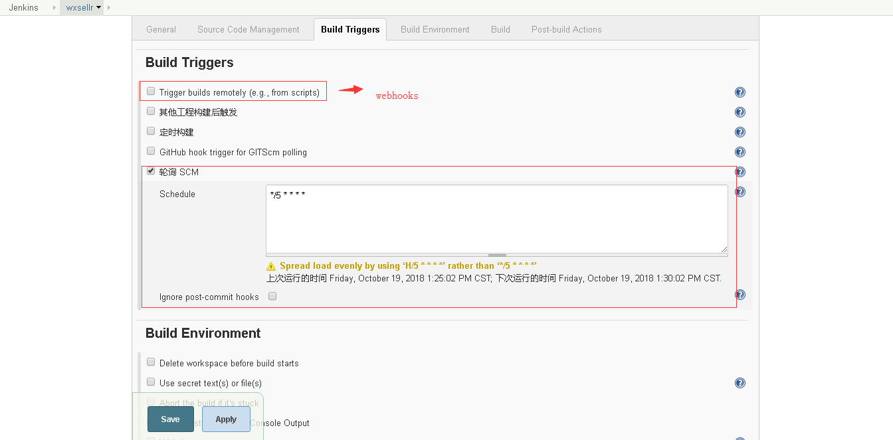
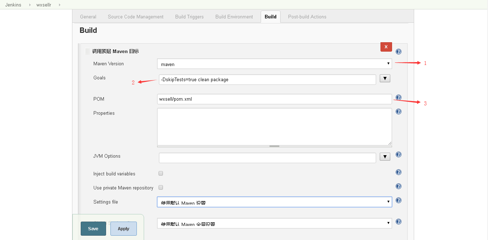
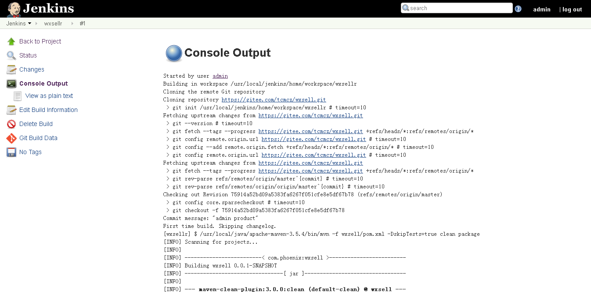

[Jenkins](https://www.w3cschool.cn/jenkins/jenkins-5h3228n2.html) 是一个开源自动化服务器，可用于自动化各种任务，如构建、测试和部署软件，本文档是结合Jenkins，Java，Maven，Github实现持续自动化编译。

## 1. 思路&流程

- 安装 Java、Maven、Git、Jenkins 环境
- 配置 Jenkins 拉取 Github 项目
- 编译、单元测试 Maven 项目形成 war 包

## 2. 环境准备

> 由于 Maven 需要 jdk 支持，所以需要先配置 jdk 环境，再配置 maven 环境。
- 准备可联网的 [Linux Centos 7.3](https://www.centos.org/download/) 服务器
- 下载 [Jdk1.8.0](https://www.oracle.com/technetwork/java/javase/downloads/jdk8-downloads-2133151.html) 并设置环境变量
- 下载 [Maven3.3](http://maven.apache.org/download.cgi) 并设置环境变量
- 安装 [Git](https://git-scm.com/download/linux)

## 3. 安装 Jenkins

> 可以设置 JENKINS_HOME 环境变量，改变 jenkins 启动生成文件存放位置.  
其它安装方式参考：[Jenkins安装](https://www.w3cschool.cn/jenkins/jenkins-79ex28jh.html)

首先从 [Jenkins官方网站](https://jenkins.io/) 下载最新的 war 包，只需运行命令：

```bash
java -jar jenkins.war --httpPort=8080
```

Jenkins 服务就启动成功了，它的 war 包自带了 jetty 服务器，剩下的工作可以在浏览器内完成。  

## 4. 配置 Jenkins

首次进入 Jenkins 时，出于安全考虑， Jenkins 会自动生成一个随机口令，粘帖口令进入安装界面。
进入 Jenkins 后选择 "**Install suggested plugins**" 安装推荐插件，Jenkins 就自动配置好了 Maven、git 等常用插件。

<hr />

在开始使用 Jenkins 创建项目前，需要在"**系统管理**"->"**全局工具配置**"中添加 JDK、Maven 设置：


到此 Maven 项目的 Jenkins 已配置完成，下面开始创建构建任务。

## 5. 构建Maven项目

在 Jenkins 首页选择"**New 任务**"，输入名字，选择"**构建一个自由风格的软件项目**"：


在配置页面中，"**Source Code Management**" 选择 **Git**，填入地址，默认使用 mater 分支，如果为私人项目需要口令，在 Credentials 中添加用户名/口令：


在 "**Build Triggers**" 中选择 "**轮询 SCM**" 表示定时检查版本库，发现有新的提交就触发构建：

> 说明1：Triggerbuilds remotely(webhooks)   
这个选项就是配合 git 仓库的钩子功能实现代码 PUSH 后 Jenkins 收到通知自动触发构建项目的动作  
说明2：轮询 SCM  
定时检查源码变更，如果有更新就克隆下最新 code 下来，然后执行构建动作

在"**Build**"中可以添加编译命令，Maven默认的Root POM是```pom.xml```，如果```pom.xml```不在根目录下，则需要填入子目录：

> 说明1：选择之前添加的 maven 环境  
说明2：填入需要执行的 mvn 命令  
说明3：pom 不在根目录下，填入子目录 wxsell/pom.xml

保存后就可以"**立即构建**"，可以在"**Console Output**"中看到控制台详细输出：


## 6. 总结

到此已配置了 Jenkins 自动编译任务，当 Github 上项目有变更时，会自动拉取项目进行编译，排除了可能不同机器上编译环境不同导致的影响。  
在完成持续编译后，可以结合 Jenkins 的编译后动作进行自动部署，实现持续部署功能。在下篇笔记中将会记录如何实现持续部署。